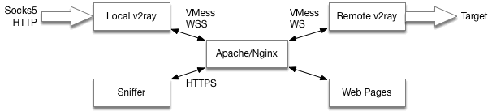

# V2Ray搭建示例

---

## 搭建目标

* 迷惑性：伪装成普通的Web Server，当通过浏览器访问域名时，能看到正常的Web页面。

* 安全性：
  * 在传输层使用TLS，防止嗅探。
  * 使用自建CA签发证书，配置客户端只信任自建CA，防止MITM攻击。

* 本地开启Socks5/HTTP代理。


## 配置说明

### 服务架构

根据需求，整个服务架构如图：



伪装工作使用Apache/Nginx处理：仅当客户端请求特定的URL Path时，才将流量转发至*remote v2ray*。其他请求都被当作普通的HTTP请求处理，返回对应的静态页面。

由于启用了TLS，而且只信任自建CA，理论上这个特殊的URL也不会暴露。

### 规划配置

在进行配置前，需要准备/规划好如下内容：

* 服务器域名，这里假定是`foo.bar`
* 转发到v2ray的URL Path，这里假定是`/wsray`
* Remote v2ray的入站端口，这里假定是`22222`
* Local v2ray的socks5代理端口和http代理端口，这里假定是`1080`和`8080`

### 准备TLS证书

> 这里示范的是使用openssl来签发证书，适用于macOS/Linux，未在Windows上测试。

**自建CA**

```
# 生成CA私钥
openssl genrsa -out ca_key.pem 4096

# 生成CA证书申请
# 会提示输入一些信息，可随意填写
openssl req -new -out ca_req.pem -key ca_key.pem

# 签发CA证书
openssl x509 -req -in ca_req.pem -out ca_cert.pem \
-signkey ca_key.pem -days 3650
```

**签发Server证书**

```
# 生成Server私钥
openssl genrsa -out server_key.pem 1024

# 生成Server证书申请
# 会提示输入一些信息，"Country Name"需要填写Server域名，即"foo.bar"，其他随意
openssl req -new -out server_req.pem -key server_key.pem

# 签发Server证书
openssl x509 -req -in server_req.pem -out server_cert.pem \
-signkey server_key.pem -days 3650 \
-CA ca_cert.pem -CAkey ca_key.pem -CAcreateserial

```

这里一共生成了6个文件。

其中`ca_req.pem`和`server_req.pem`是中间过程的过渡文件，可以删除。

如果不需要使用同一个CA签发其他证书，那么`ca_key.pem`也可以删除。

剩下3个文件的用途如下：

* `ca_cert.pem`：根CA证书，用于配置到*local v2ray*的信任证书中。
* `server_key.pem`和`server_cert.pem`：服务器私钥和证书，用于配置到Apache或Nginx中。

### 配置HTTP Server

将前面生成的`server_key.pem`和`server_cert.pem`，上传到用来部署*remote v2ray*的服务器上。

确保你的服务器上安装了Apache HTTP Server或者Nginx。

针对HTTP Server的配置主要包括以下几项：

* TLS证书
* 用于伪装的Web页面
* 到remote v2ray的流量转发

**Apache配置**

```
# 首先需要取保以下模块已经启用：
#   ssl_module
#   proxy_module
#   proxy_http_module
#   proxy_wstunnel_module

<VirtualHost *:443>

    # 配置域名
    ServerName "foo.bar"

    # 配置TLS证书
    SSLEngine on
    SSLCertificateFile    "/path/to/server_cert.pem"
    SSLCertificateKeyFile "/path/to/server_key.pem"

    # 配置v2ray流量转发
    ProxyPass        "/wsray" "ws://127.0.0.1:22222"
    ProxyPassReverse "/wsray" "ws://127.0.0.1:22222"

    # 配置用于伪装的静态页面
    DocumentRoot "/path/to/webroot"
    <Directory "/path/to/webroot">
        Options All Indexes FollowSymLinks Multiviews
        MultiviewsMatch Any

        AllowOverride None
        Require all granted
    </Directory>

</VirtualHost>
```

**Nginx配置**

```
server {

    # 监听443端口，启用SSL
    listen 443 ssl;

    # 配置域名
    server_name foo.bar;

    # 配置TLS
    ssl_certificate     /path/to/server_cert.pem;
    ssl_certificate_key /path/to/server_key.pem;

   	# 配置v2ray流量转发
    location ^~ /wsray {
        proxy_pass http://127.0.0.1:22222;
        proxy_http_version 1.1;
        proxy_set_header Upgrade $http_upgrade;
        proxy_set_header Connection "Upgrade";
    }

    # 配置用于伪装的静态页面
    location / {
        root  /path/to/webroot;
        index index.html;
    }

}
```

**校验TLS配置**

这里使用`curl`进行校验：

```
curl -v --cacert /path/to/ca_cert.pem https://foo.bar/
```

如果正常请求到了伪装的静态页面，说明TLS配置已经正常。

### 配置Remote v2ray

> 这里只列出必要的配置，其他配置项可根据实际需求增加/调整。

```
{
  "log": {
    "loglevel": "warning"
  },

  "inbounds": [{
    "tag": "inbound-ws-vmess",
    "port": 22222,
    "listen": "127.0.0.1",
    "protocol": "vmess",
    "settings": {
      "clients": [{
        "id": "xxxxxxxx-yyyy-yyyy-yyyy-zzzzzzzzzzzz",
        "level": 0,
        "alterId": 4,
        "email": "sadpanda@foo.bar"
      }]
    },
    "streamSettings": {
      "network": "ws",
      "security": "none",
      "wsSettings": {
        "path": "/wsray"
      }
    }
  }],

  "outbounds": [{
    "tag": "direct",
    "protocol": "freedom",
    "settings": {}
  }]
}
```

### 配置Local v2ray

> 这里只列出必要的配置，其他配置项可根据实际需求增加/调整。

```
{
  "inbounds": [{
    "tag": "inbound-socks5",
    "port": 1080,
    "listen": "127.0.0.1",
    "protocol": "socks",
    "settings": {
      "auth": "noauth",
      "udp": true,
      "ip": "127.0.0.1"
    }
  },
  {
    "tag": "inbound-http",
    "port": 8080,
    "listen": "127.0.0.1",
    "protocol": "http",
    "settings": {}
  }],

  "outbounds": [{
    "tag": "outbound-vmess",
    "protocol": "vmess",
    "settings": {
      "vnext": [{
        "address": "foo.bar",
        "port": 443,
        "users": [{
          "id": "xxxxxxxx-yyyy-yyyy-yyyy-zzzzzzzzzzzz",
          "level": 0,
          "alterId": 4,
          "email": "sadpanda@foo.bar"
        }]
      }]
    },
    "streamSettings": {
      "network": "ws",
      "security": "tls",
      "wsSettings": {
        "path": "/wsray"
      },
      "tlsSettings": {
        "serverName": "foo.bar",
        "allowInsecure": false,
        "disableSystemRoot": true,
        "certificates": [{
          "usage": "verify",
          "certificateFile": "ca_cert.pem"
        }]
      }
    }
  }]
}

```
